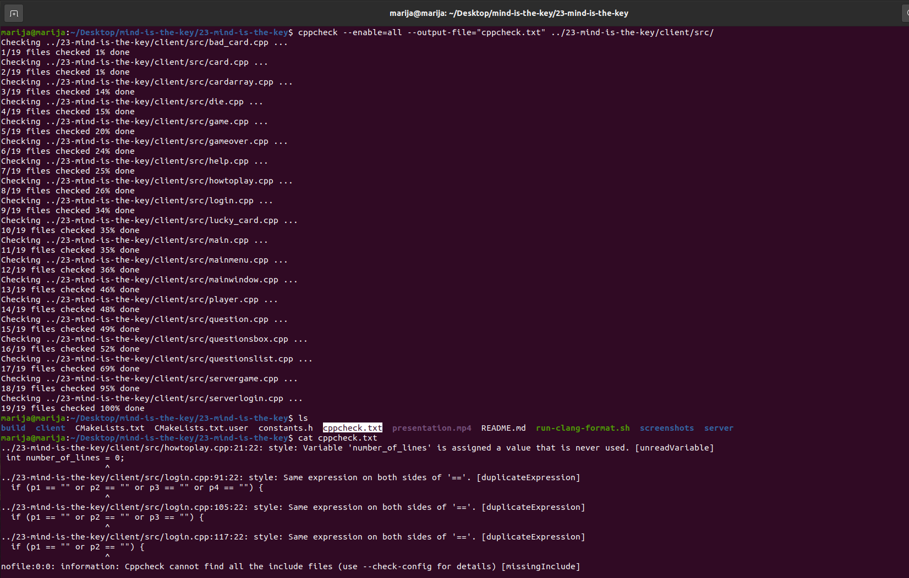
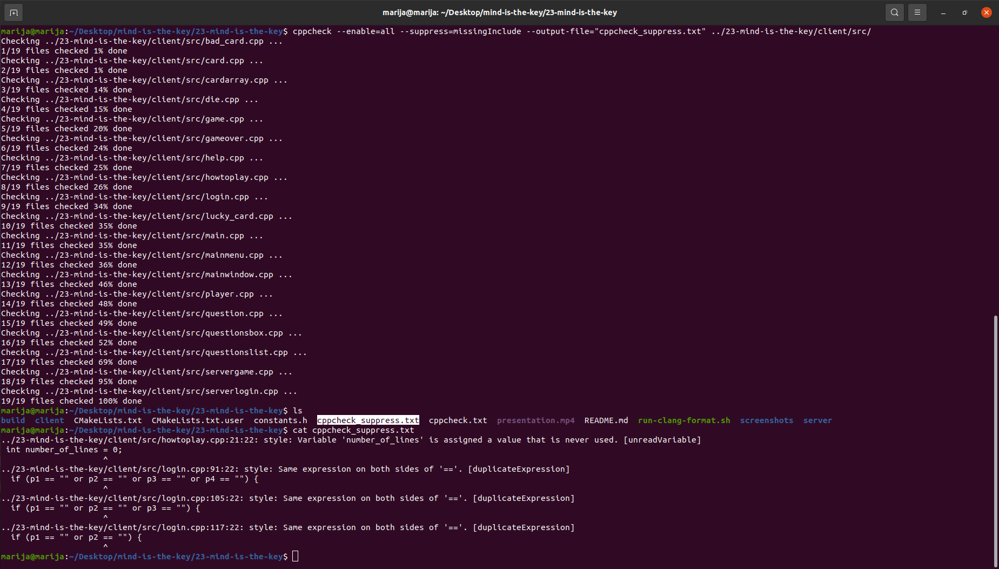
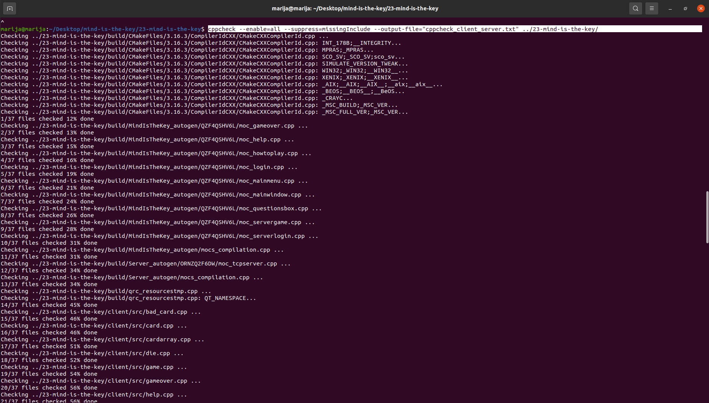

# Izveštaj analize projekta

## Clang 
**Clang** je kompilator zasnovan na `LLVM (Low-Level Virtual Machine)` projektu koji se koristi za jezike `C, C++, Objective C i Objective C++`.
Predstavlja frontend koji kao ulaz uzima kod napisan u prethodno navedem jezicima i prevodi ga u međureprezentaciju tj. *llvm IR* i to predstavlja ulaz za središnji deo na kojem se vrše optimizacije nezavisne od jezika i arhitekture. Na kraju backend vrši optimizacije vezane za konkretnu arhitekturu i prevodi kod na mašinski jezik. Clang je implementiran u `C++`-u i dizajniran da bude brz, efikasan i modularan.

### Clang-Tidy
**Clang-Tidy** predstavlja jedan od `Clang` zasnovanih alata koji obavlja statičku analizu koda i proveru stila (vrši analiziranje izvornog koda bez njegovog izvršavanja sa ciljem pronalaženja grešaka, poboljšanja kvaliteta koda i ispravljanja neoptimalno napisanih delova koda). Takođe može da pomogne u modernizaciji koda u skladu sa najnovijim standardima i najboljim praksama.

### Clazy
**Clazy** je alat specifičan za projekte bazirane na `Qt` okruženju, koji koristi `Clang` kao osnovu za statičku analizu. Prilagođen je `Qt` bibliotekama i otkriva neefikasne upotrebe `QString, QList, QHash` -a, pogrešnu upotrebu `Qt API`-ja (npr. korišćenje `signals` i `slots`) i mnoge druge propuste.

Ovi alati su integrisani u `QtCreator`-u i mogu se pokrenuti sa podrazumevanim (*default*) ili sa prilagođenom (*custom*) konfiguracijom.
1) Pokretanje sa `default` (podrazumevanom) konfiguracijom zahteva odabir kartice `Analyze` i opcije `Clang-Tidy and Clazy`
   


Nakon toga se izaberu fajlovi nad kojima će se vršiti analiza:


Pritiskom na dugme `Analyze` pokreće se analiza. Kada se završi, vidimo rezultat analize svih fajlova. Neka upozorenja se odnose na curenje memorije, neka na nekorišćene promenljive, na potencijalno problematično imenovanja slotova itd.


2) Pokretanje `custom` definisane konfiguracije zahteva odabir kartice `Tools`, zatim `Options`, pa `Analyzer` i klik na `Default Clang-Tidy and Clazy checks`


Nakon toga je potrebno kopirati default-nu konfiguraciju, preimenovati je (u mom slučaju `Default Clang-Tidy and Clazy checks (Custom)`) i u njoj izmeniti željene opcije. Npr. ja sam u okviru *Clang-Tidy checks* kartice dodala pored podrazumevane `clang-*` opcije, `modernize-*` i `performance-*`


Nakon ponovnog pokretanje analize primećujemo da ima mnogo više upozorenja i potencijalnih izmena u cilju poboljšanja koda:


### ClangAnalyzer
**ClangAnalyzer** je alat za statičku analizu koda koji efikasno otkriva curenje memorije, probleme sa neinicijalizovanim promenljivama i dereferenciranje `null` pokazivača.
Fokusiran je na otkrivanje logičkih grešaka i pogodan je za velike projekte gde je teško ručno identifikovati greške.
Za pokretanje alata potrebno je pozicionirati se u `build` direktorijum i izvršiti sledeću komandu `scan-build make`.
Rezultat je `No bugs found` što se može videti na slici:


### Cppcheck
**Cppcheck** je alat koji se koristi za statičku analizu C i C++ koda. Osnovna uloga je otkrivanje potencijalnih problema pre pokretanja programa. Detektuje curenja memorije, neinicijalizovane promenljive, probleme sa pokazivačima...
Da bi se instalirao *Cppcheck* alat potrebno je pokrenuti sledeću komandu:
```
sudo apt-get install cppcheck
```

Alat se pokreće komandom 
```
cppcheck --enable=all --output-file="cppcheck.txt" ../23-mind-is-the-key/client/src/
```
u kojoj `--enable=all` omogućava sve dostupne provere, `--output-file="cppcheck.txt"`omogućava da se rezultat analize upiše u novokreirani fajl *cppcheck.txt*, a `../23-mind-is-the-key/client/src/` se odnosi na putanju do fajlova koji će biti uključeni u analizu.

Prikaz pokretanja komande, kreiranje fajla za rezultat i sadržaj rezultata:



Rezultat pokretanja [skipte](cppcheck/cppcheck.sh) se nalazi u [fajlu](cppcheck/cppcheck.txt).

Moguće je uključiti opciju `--suppress=missingInclude` i na taj način cppcheck će zanemariti sve poruke koje ukazuju na nedostatak potrebnih uključivanja (header files).

[Skipta](cppcheck/cppcheck_suppress.sh), kreiranje izlaznog fajla [cppcheck_suppress.txt](cppcheck/cppcheck_suppress.txt) i sadržaj rezultata se nalazi na sledećoj slici:



Pokretanje [skipte](cppcheck/cppcheck_client_server.sh) prikazano je na narednoj slici:



`../23-mind-is-the-key` označava da će u analizu biti uključeni svi fajlovi iz korenog direktorijuma, a rezultat se generisao u fajlu [cppcheck_client_server.txt](cppcheck/cppcheck_client_server.txt)

